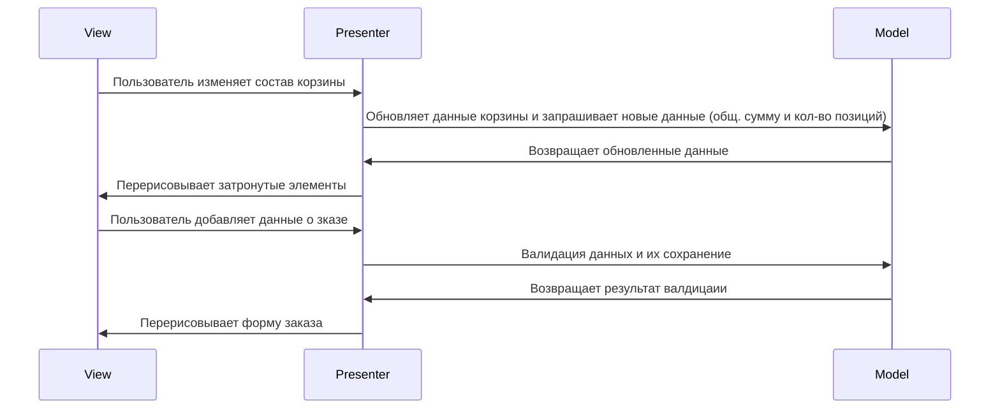
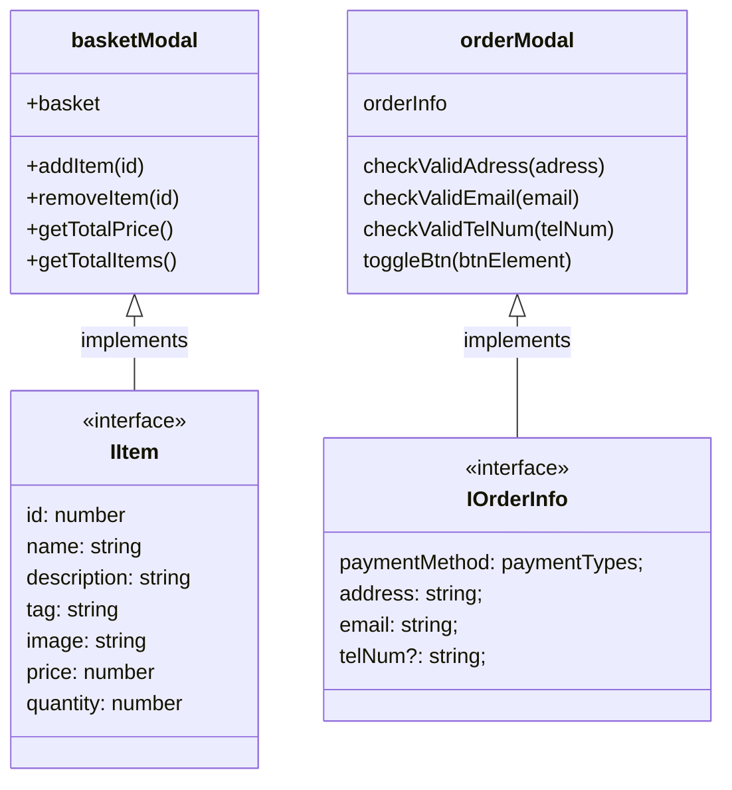
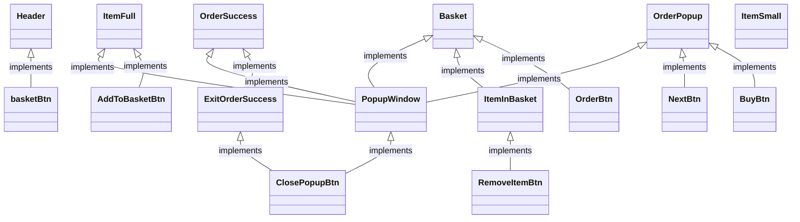

# Проектная работа "Веб-ларек"

Стек: HTML, SCSS, TS, Webpack

Структура проекта:
- src/ — исходные файлы проекта
- src/components/ — папка с JS компонентами
- src/components/base/ — папка с базовым кодом

Важные файлы:
- src/pages/index.html — HTML-файл главной страницы
- src/types/index.ts — файл с типами
- src/index.ts — точка входа приложения
- src/scss/styles.scss — корневой файл стилей
- src/utils/constants.ts — файл с константами
- src/utils/utils.ts — файл с утилитами

<details><summary>🛠️ Установка и запуск</summary>
Для установки и запуска проекта необходимо выполнить команды

```
npm install
npm run start
```

или

```
yarn
yarn start
```
</details>
<details><summary>🏗️ Сборка</summary>

```
npm run build
```

или

```
yarn build
```
</details>

# 📘 Документация
Приложение использует архитектуру **MVP**, основная логика разделена на логику для корзины и логику для заказа. Сделано это для изолирования, будущего расширения приложение и переиспользования модулей.
### Быстрая навигация:
- [Утилиты](#Утилиты)
- [Классы слоя модели](#Классы-слоя-модели)
- [Классы слоя представления](#Классы-слоя-представления)
- [Слой просмотра](#Слой-просмотра)
- [Интерфейсы](#Интерфейсы)

## Общая схема взаимодействия слоев MVP архитектуры:




## Утилиты
### Класс API
Класс API используется для работы с сервером, сетевые запросы GET создаются методом get(url), другие типы запросов реализуется через post(url, data, method = POST)


## Классы слоя модели



### Класс basketModal
Используется для манипуляции данных корзины, где: addItem(id) добавляет товар, removeItem(id) удаляет его, getTotalPrice() возвращает общую стоимость заказа, а getTotalItems() показывает кол-во товаров в корзине.

<details><summary>Код</summary>

```Typescript
export class basketModal {
  static basket: IItem[] = [];

  addItem(id:number): void {}
  removeItem(id:number): void {}
  getTotalPrice(): number {}
  getTotalItems(): number {}
}
```
</details>

### Класс orderModal
Используется для проверки данных заказа на валидность, инцирует объект данных заказа.

<details><summary>Код</summary>

```Typescript
export class orderModal {
  static orderInfo: IOrderInfo = {
    paymentMethod = null,
    address = null,
    email = null,
    telNum = null,
  };

  checkValidAdress(adress: string): boolean {}
  checkValidEmail(email: string): boolean {}
  checkValidTelNum(telNum: string): boolean {}
}
```
</details>


## Классы слоя представления

### Класс ItemSmallHandler
Отвечает за открытие модального окна товара с нужными данными
<details><summary>Код</summary>

```Typescript
class ItemSmallHandler {
  openFullItemPopup(ItemData: IItem): void {}
}
```
</details>

### Класс BasketChangeHandler
Отвечает за обновление данных корзины и перерисовку связанных элементов
<details><summary>Код</summary>

```Typescript
class BasketChangeHandler implements basketModal {
  updateBasketIcon(): void {
    basketModal.getTotalItems();
  }

  updateRender(): void {}

  addToBasket(id: number): void {
    basketModal.addItem(id);
    this.updateBasketIcon();
  }

  removeFromBasket(id: number): void {
    basketModal.removeItem(id);
    this.updateBasketIcon();
    this.updateRender();
  }
}
```
</details>

### Класс Orderhandler
Отвечает за валидацию вводимых данных, перерисовку элементов формы (показ ошибки данных и кнопка перехода на другую страницу попапа)
<details><summary>Код</summary>

```Typescript
class Orderhandler implements orderModal {
  changeValidity(isValid: boolean, formInputFieldElement: HTMLElement): void {}
  changeBtnDisableAtr(isFormValid: boolean, btnElement: HTMLButtonElement): void {}

  validateInput(inputData: any, validatingMethod: any, targetInputFieldElement: HTMLElement, formElement: HTMLFormElement, formBtnElement: HTMLButtonElement): void {
    this.changeValidity(validatingMethod(inputData), targetInputFieldElement);
    this.changeBtnDisableAtr(formElement.validity.valid, formBtnElement);
  }

  continueOrder(orderData: IOrderInfo) {}
  renderNextPage() {}
}

```
</details>

## Слой просмотра



### Класс хедера страницы - Header
Создает элемент хедера страницы и включает в себя кнопку корзины, которая показывает кол-во товаров, добавленных в корзину.

### Класс Товара в свернутом виде - ItemSmall
Частично использует данные товара, при нажатии открывает попап товара в развернутом виде.

### Класс попапа - PopupWindow
Класс нужен как контейнер для элементов на сайте.

### Класс Товара в развернутом виде - ItemFull
Использует почти все данные товара, имплементирует класс попапа как контейнера. 

### Класс Окна корзины - Basket
Использует попап как контейнер, получает данные корзины от basketModal(позиции и общую цену). Используемые классы: ItemInBasket для позиций товаров в корзине, OrderBtn для перехода на попапы оформления заказа.

### Класс Окна оформления заказа - OrderPopup
Использует попап как контейнер, либо принимает поля как аргумент для их отрисовки, либо переключает видимость попапов в разметки (в зависимоти от требований проекта). Использует класс orderModal для проверки валидности полей.

### Класс успешного оформления заказа - OrderSuccess
Использует попап как контейнер, кнопка "совершения новых заказов" переделанная кнопка закрытия попапа, полную стоимость заказа получает от basketModal.

## Интерфейсы
### Интерфейс товара:

<details><summary>Код</summary>

```Typescript
export interface IItem {
  id: number;
  name: string;
  description: string;
  tag: string;
  image: string;
  price: number;
  quantity?: number;
}
```
</details>

### Интерфейс данных заказа:

<details><summary>Код</summary>

```Typescript
export interface IOrderInfo {
  paymentMethod: paymentTypes;
  address: string;
  email: string;
  telNum?: string;
}
```
</details>