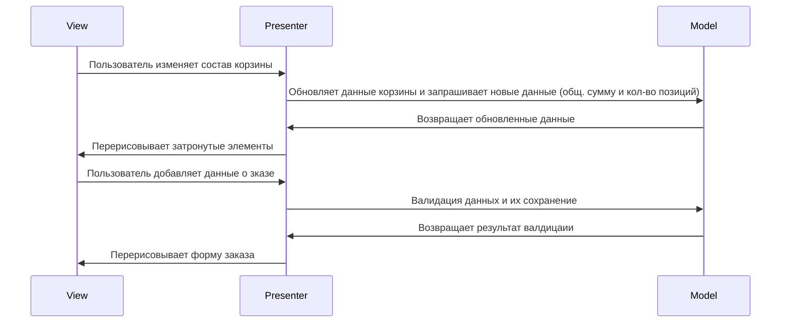
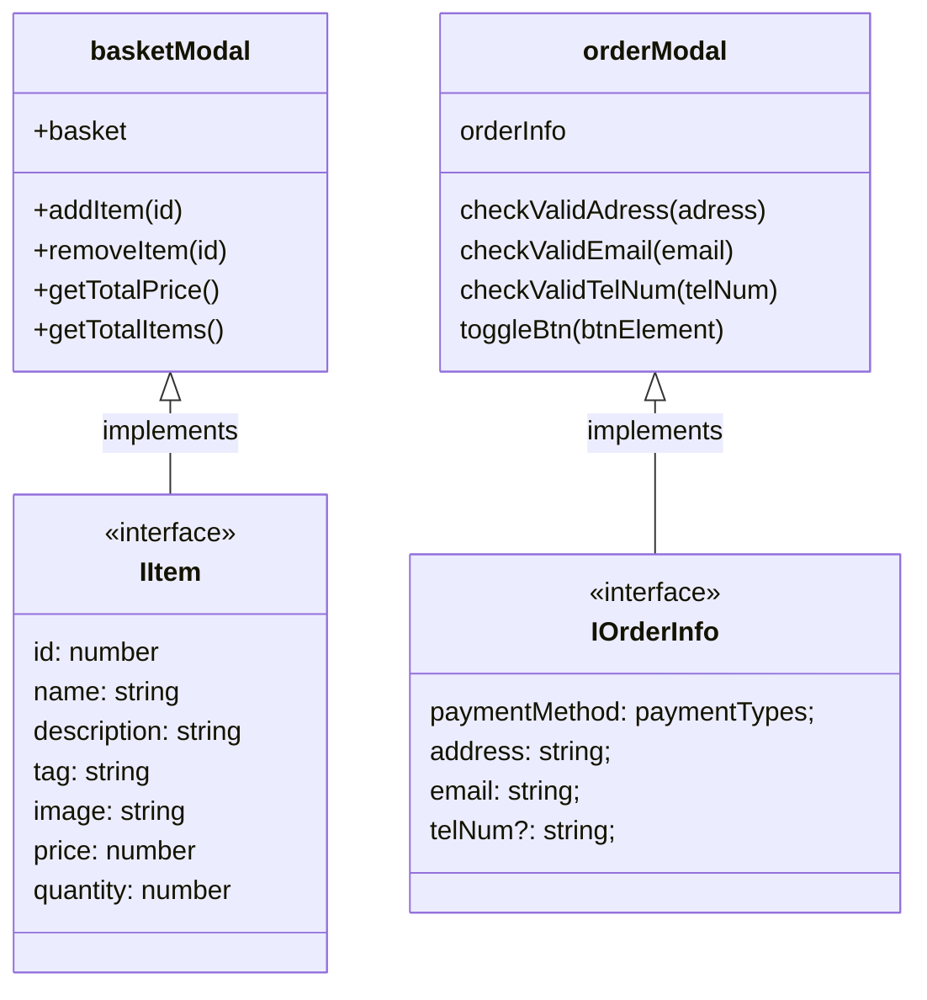
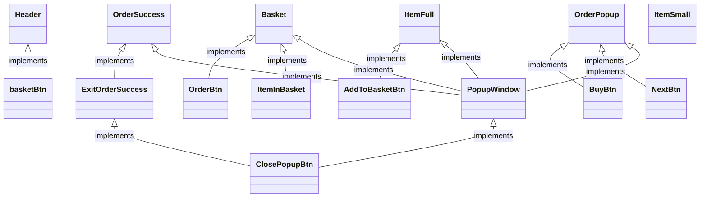

# Проектная работа "Веб-ларек"

Стек: HTML, SCSS, TS, Webpack

Структура проекта:
- src/ — исходные файлы проекта
- src/components/ — папка с JS компонентами
- src/components/base/ — папка с базовым кодом

Важные файлы:
- src/pages/index.html — HTML-файл главной страницы
- src/types/index.ts — файл с типами
- src/index.ts — точка входа приложения
- src/scss/styles.scss — корневой файл стилей
- src/utils/constants.ts — файл с константами
- src/utils/utils.ts — файл с утилитами

<details><summary>🛠️ Установка и запуск</summary>
Для установки и запуска проекта необходимо выполнить команды

```
npm install
npm run start
```

или

```
yarn
yarn start
```
</details>
<details><summary>🏗️ Сборка</summary>

```
npm run build
```

или

```
yarn build
```
</details>

# 📘 Документация
Приложение использует архитектуру **MVP**, основная логика разделена на логику для корзины и логику для заказа. Сделано это для изолирования, будущего расширения приложение и переиспользования модулей.




## Утилиты
### Класс API
Класс API используется для работы с сервером, сетивые запросы GET создаются методом get(url), другие типы запросов реализуется через post(url, data, method = POST)


## Классы слоя модели



### Класс корзины
Используется для манипуляции данных корзины, где: addItem(id) добавляет товар, removeItem(id) удаляет его, getTotalPrice() возвращает общую стоимость заказа, а getTotalItems() показывает кол-во товаров в корзине
<details><summary>Код и ссылка</summary>

```Typescript
export class basketModal {
  static basket: IItem[] = [];

  addItem(id:number) {}
  removeItem(id:number) {}
  getTotalPrice(): number {}
  getTotalItems(): number {}
}
```
</details>

### Класс заказа

<details><summary>Код и ссылка</summary>

```Typescript
export class orderModal {
  orderInfo: IOrderInfo;

  checkValidAdress(adress: string) {}
  checkValidEmail(email: string) {}
  checkValidTelNum(telNum: string) {}

  toggleBtn(btnElement: HTMLButtonElement) {}
}
```
</details>


## Слой представления

## Слой просмотра



### Класс Заголовка

### Класс Товара в свернутом виде

### Класс Товара в развернутом виде

### Класс Окна корзины

### Класс Окна оформления заказа

### Класс Класс успешного оформления заказа

## Интерфейсы
### Интерфейс товара:

<details><summary>Код и ссылка</summary>

```Typescript
export interface IItem {
  id: number;
  name: string;
  description: string;
  tag: string;
  image: string;
  price: number;
  quantity?: number;
}
```
</details>

### Интерфейс данных заказа:

<details><summary>Код и ссылка</summary>

```Typescript
export interface IOrderInfo {
  paymentMethod: paymentTypes;
  address: string;
  email: string;
  telNum?: string;
}
```
</details>